<h1 align="center">.✦ ݁˖ Hello! I'm Morel! ⋆˚࿔</h1>
<h3 align="center">An Information Technology student sharing some of my works</h3>
<h4 align="center">"Given Time, Technique Never Fails"    - Smithing Master Hewg</h4>

  

- 💻 Learning about **Linux, System Administration,** and **Automation**
- 🔨 Building a personal **HomeLab** for System Administration & Networking

<h3 align="Center">Connect with me:</h3>

  
  
  

<h3 align="Center">Languages and Tools:</h3>

  

 

